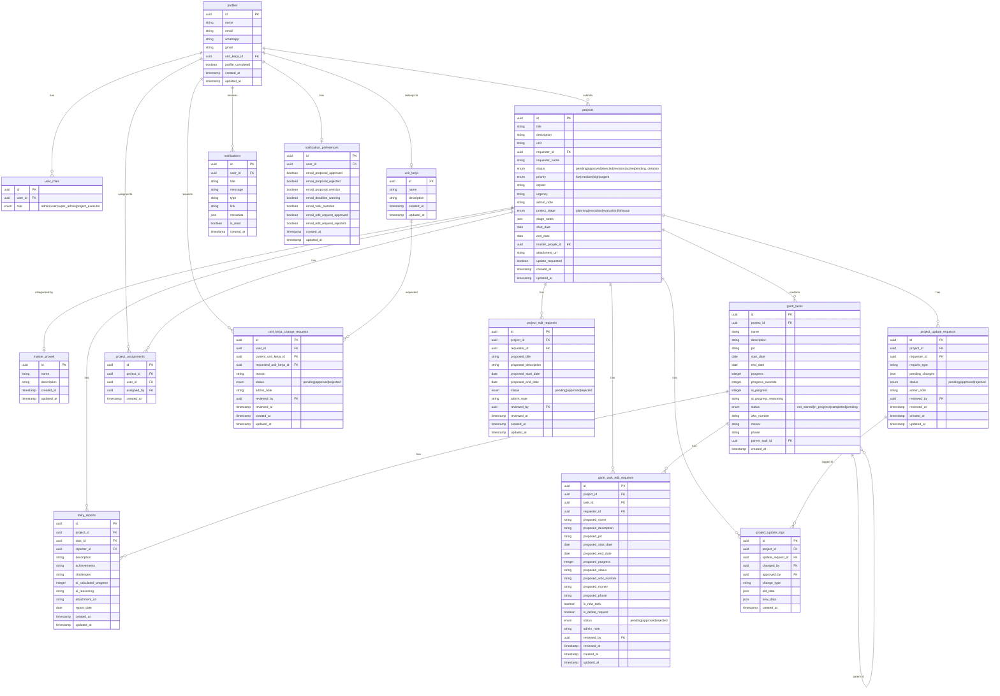

# Entity Relationship Diagram (ERD)

Diagram ini menggambarkan struktur database SIMAPROS dan relasi antar tabel.

## Diagram

## Penjelasan Tabel

### Tabel Utama

| Tabel | Deskripsi |
|-------|-----------|
| `profiles` | Data profil pengguna |
| `user_roles` | Role pengguna (super_admin, project_executor, user) |
| `projects` | Data proyek |
| `gantt_tasks` | Task dalam proyek (Gantt chart) |

### Tabel Master Data

| Tabel | Deskripsi |
|-------|-----------|
| `unit_kerja` | Daftar unit kerja/departemen |
| `master_proyek` | Kategori proyek |

### Tabel Request & Approval

| Tabel | Deskripsi |
|-------|-----------|
| `unit_kerja_change_requests` | Permintaan perubahan unit kerja |
| `project_edit_requests` | Permintaan edit proyek |
| `gantt_task_edit_requests` | Permintaan edit task |
| `project_update_requests` | Permintaan update umum |
| `project_update_logs` | Log perubahan proyek |

### Tabel Pendukung

| Tabel | Deskripsi |
|-------|-----------|
| `project_assignments` | Penugasan user ke proyek |
| `daily_reports` | Laporan harian task |
| `notifications` | Notifikasi sistem |
| `notification_preferences` | Preferensi notifikasi user |

## Catatan Keamanan

- Semua tabel memiliki Row Level Security (RLS) aktif
- User hanya bisa mengakses data sesuai role dan assignment
- Super Admin memiliki akses penuh ke semua data
