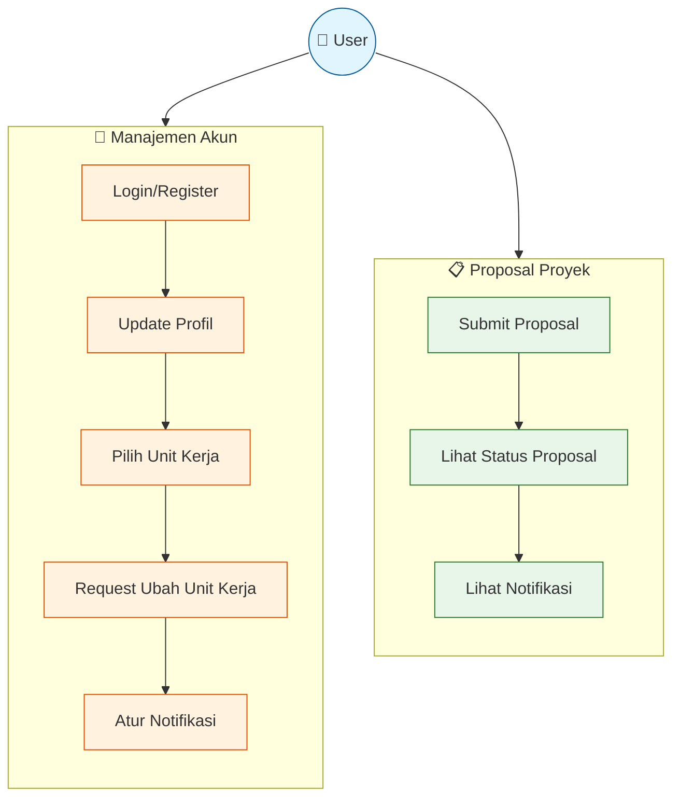
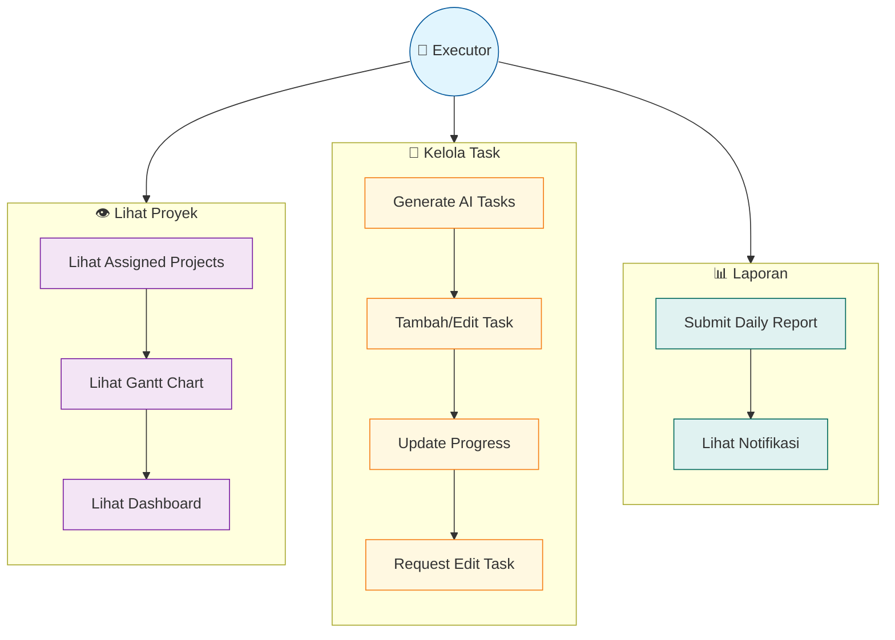
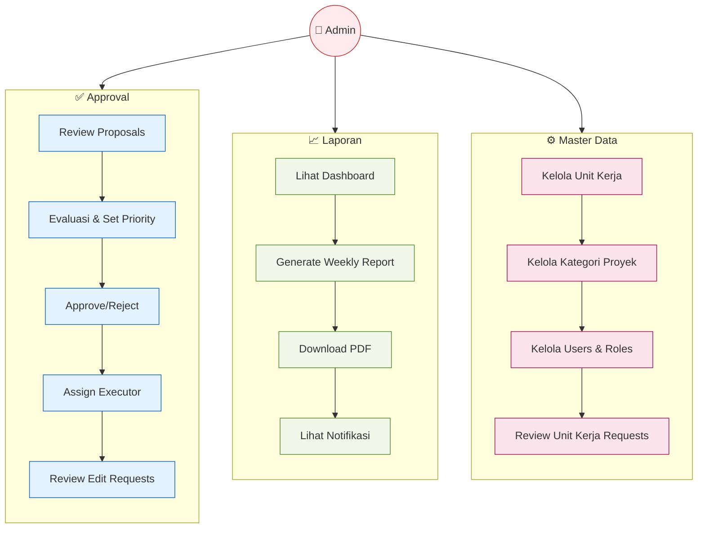
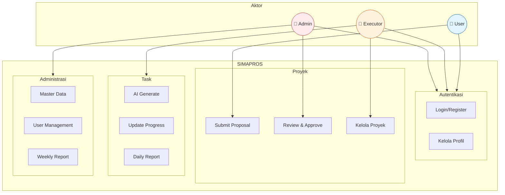
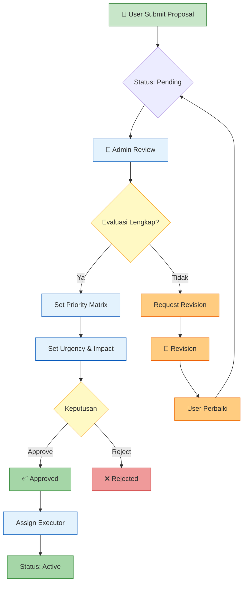
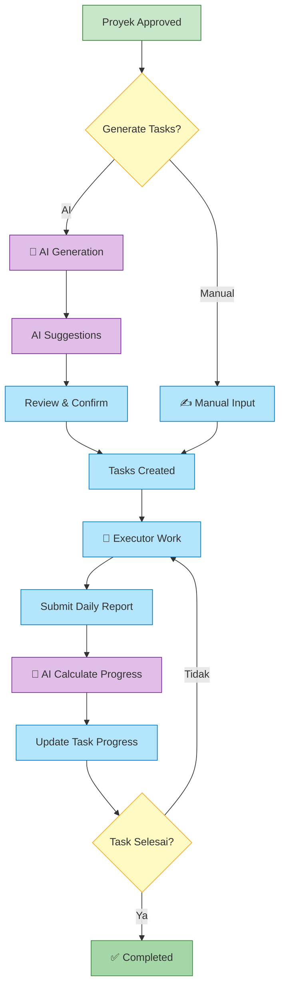

# Use Case Diagram

Diagram ini menggambarkan interaksi antara aktor dengan sistem SIMAPROS.

---

## 👤 User (Pengguna Umum)

| Use Case | Deskripsi | Prekondisi |
|----------|-----------|------------|
| Login/Register | Masuk atau daftar akun baru | - |
| Update Profil | Mengubah data profil | Sudah login |
| Pilih Unit Kerja | Memilih unit kerja pertama kali | Profil belum lengkap |
| Request Ubah Unit Kerja | Mengajukan perubahan unit kerja | Sudah punya unit kerja |
| Submit Proposal | Mengajukan proposal proyek baru | Sudah login |
| Lihat Status | Melihat status proposal yang diajukan | Punya proposal |

---

## 🔧 Project Executor

| Use Case | Deskripsi | Prekondisi |
|----------|-----------|------------|
| Lihat Assigned Projects | Melihat proyek yang ditugaskan | Di-assign ke proyek |
| Lihat Gantt Chart | Melihat timeline task proyek | Punya akses proyek |
| Generate AI Tasks | Membuat task otomatis dengan AI | Proyek approved |
| Update Progress | Memperbarui progress task | Task assigned |
| Submit Daily Report | Membuat laporan harian | Task dalam progress |

---

## 👑 Super Admin

| Use Case | Deskripsi | Prekondisi |
|----------|-----------|------------|
| Review Proposals | Meninjau proposal masuk | Ada proposal pending |
| Set Priority Matrix | Menentukan urgency & impact | Saat evaluasi proposal |
| Approve/Reject | Menyetujui atau menolak proposal | Sudah dievaluasi |
| Assign Executor | Menugaskan pelaksana proyek | Proyek approved |
| Review Requests | Meninjau permintaan perubahan | Ada request pending |
| Generate Report | Membuat laporan mingguan AI | Ada proyek aktif |
| Kelola Master Data | CRUD unit kerja & kategori | - |
| Kelola Users | Mengatur role pengguna | - |

---

## 📊 Diagram Ringkasan Sistem

---

## 🔄 Alur Detail: Approval Proyek

---

## 🔄 Alur Detail: Task Management

