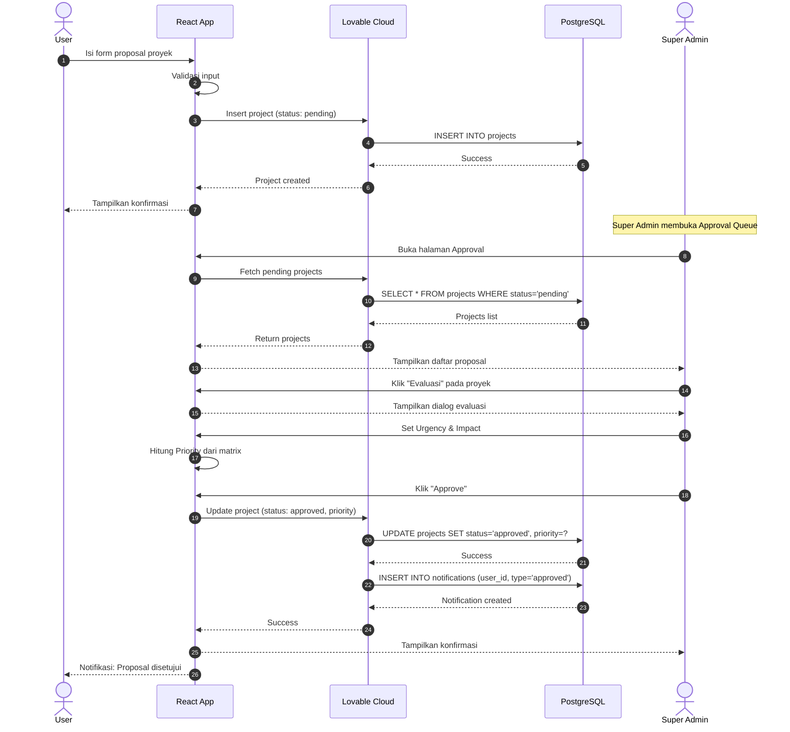
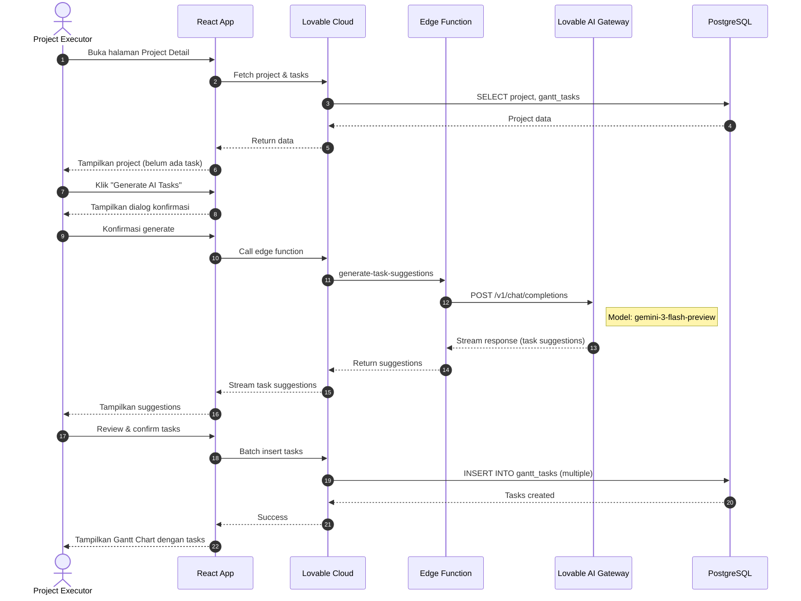
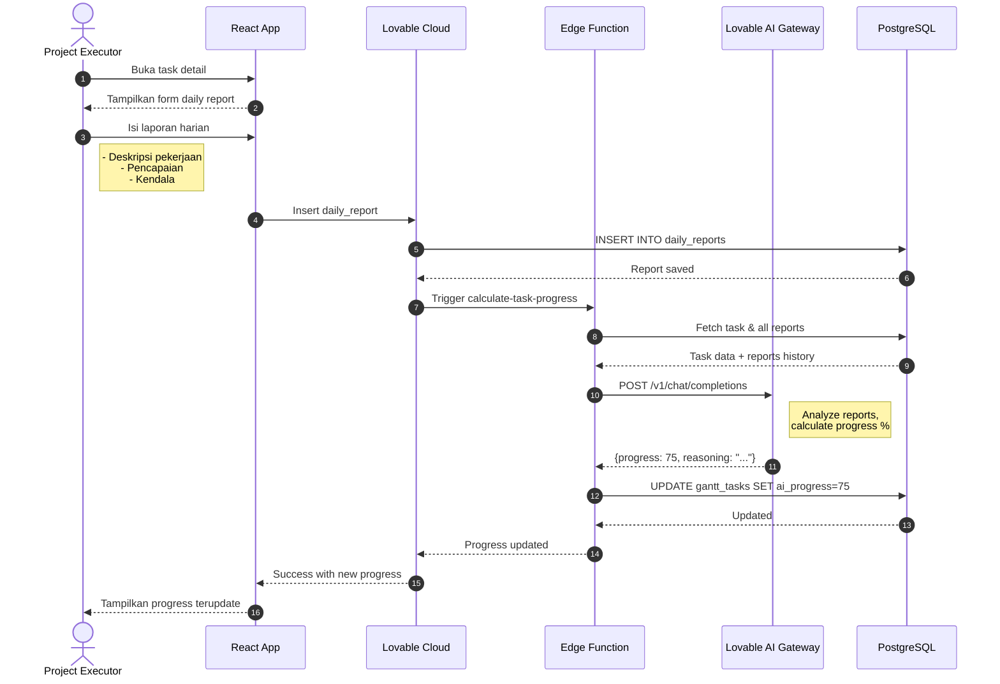
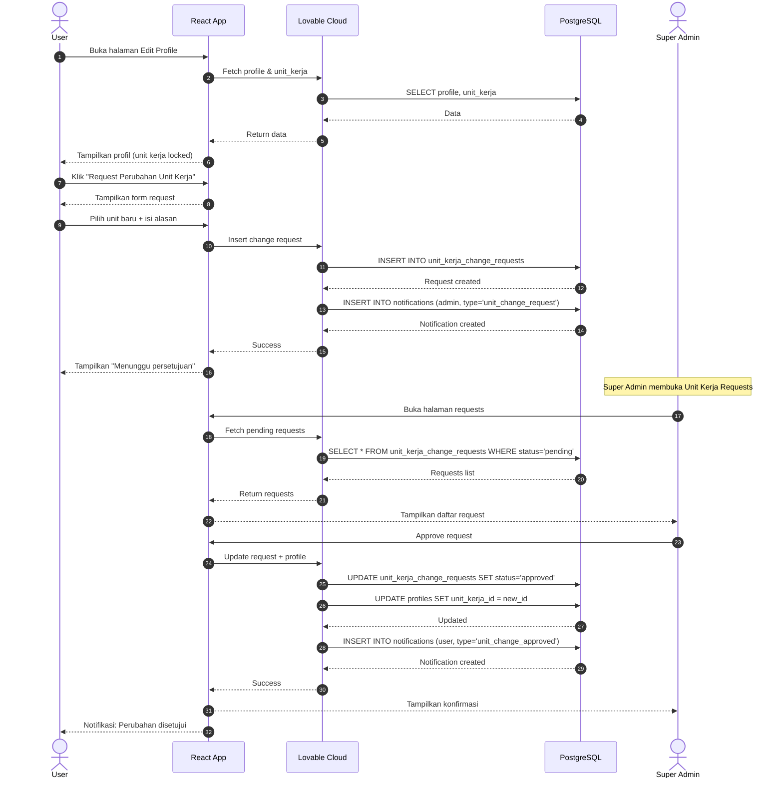
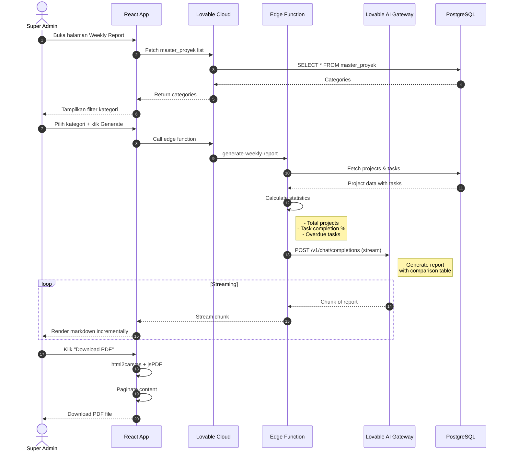
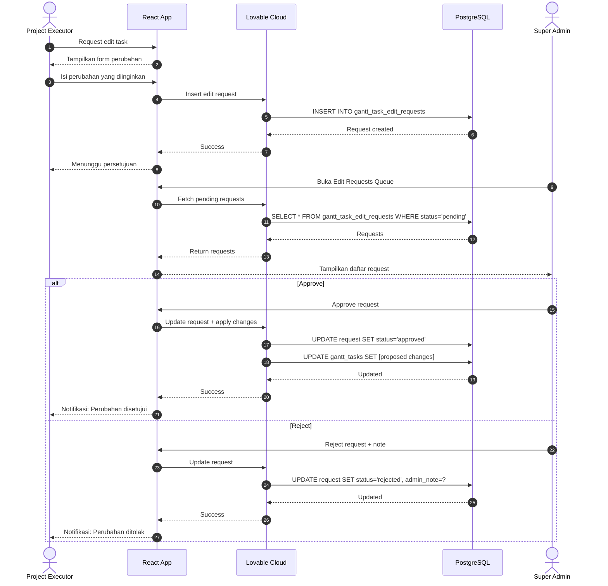

# Sequence Diagram

Diagram ini menggambarkan alur proses utama dalam sistem SIMAPROS.

## 1. Submit & Approval Proyek

## 2. Generate AI Tasks

## 3. Submit Daily Report & AI Progress

## 4. Request Perubahan Unit Kerja

## 5. Generate Weekly Report

## 6. Task Edit Request Flow

