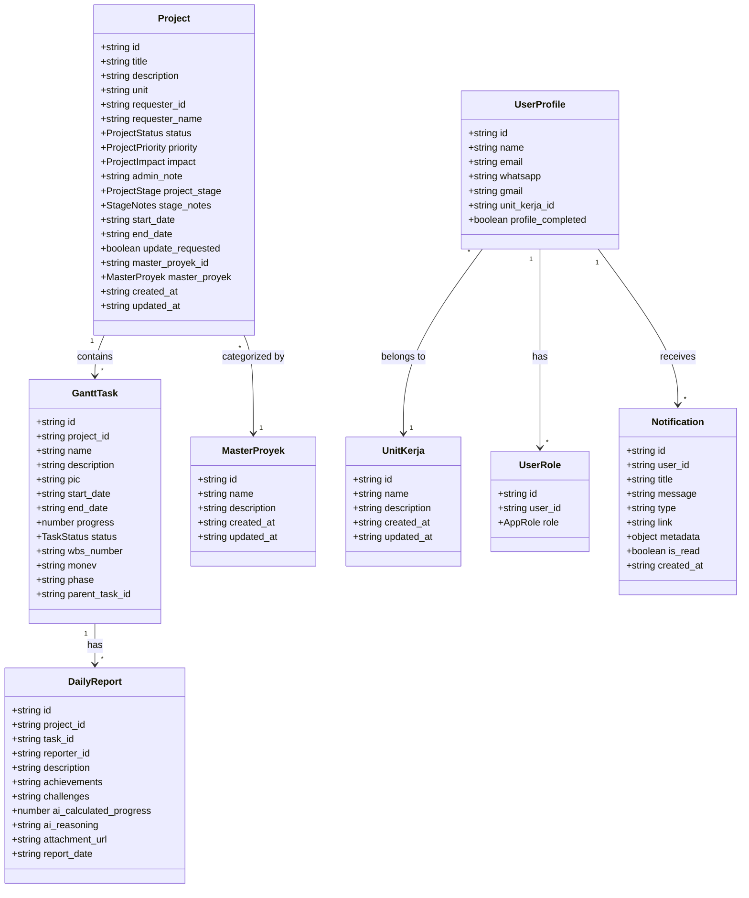
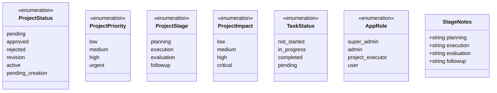
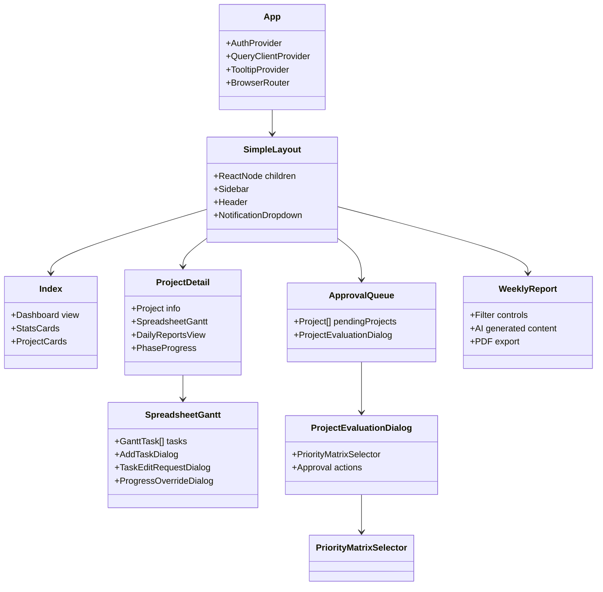
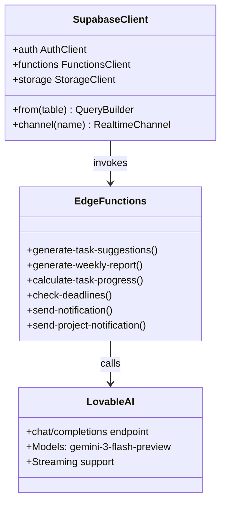

# Class Diagram

Diagram ini menggambarkan struktur kode frontend SIMAPROS.

## React Hooks Architecture

```mermaid
classDiagram
    class useAuth {
        -User user
        -Session session
        -UserProfile profile
        -AppRole role
        -boolean loading
        +signIn(email, password) Promise
        +signUp(email, password, name) Promise
        +signOut() Promise
        +isAdmin boolean
        +isSuperAdmin boolean
        +isProjectExecutor boolean
    }

    class useProjects {
        -Project[] projects
        -boolean loading
        +fetchProjects() void
        +createProject(data) Promise
        +updateProject(id, data) Promise
        +deleteProject(id) Promise
        +refetch() void
    }

    class useUsers {
        -UserWithRole[] users
        -boolean loading
        +fetchUsers() void
        +updateUserRole(userId, role) Promise
        +updateUserProfile(userId, data) Promise
        +deleteUser(userId) Promise
        +refetch() void
    }

    class useNotifications {
        -Notification[] notifications
        -number unreadCount
        -boolean loading
        +fetchNotifications() void
        +markAsRead(id) Promise
        +markAllAsRead() Promise
    }

    class useProfile {
        -UserProfile profile
        -boolean loading
        +updateProfile(data) Promise
        +refetch() void
    }

    class useUnitKerja {
        -UnitKerja[] unitKerjaList
        -boolean loading
        +fetchUnitKerja() void
        +createUnitKerja(data) Promise
        +updateUnitKerja(id, data) Promise
        +deleteUnitKerja(id) Promise
    }

    class useMasterProyek {
        -MasterProyek[] masterProyekList
        -boolean loading
        +fetchMasterProyek() void
        +createMasterProyek(data) Promise
        +updateMasterProyek(id, data) Promise
        +deleteMasterProyek(id) Promise
    }

    class useTaskEditRequests {
        -TaskEditRequest[] requests
        -boolean loading
        +fetchRequests() void
        +approveRequest(id) Promise
        +rejectRequest(id, note) Promise
    }

    class useProjectEditRequests {
        -ProjectEditRequest[] requests
        -boolean loading
        +fetchRequests() void
        +approveRequest(id) Promise
        +rejectRequest(id, note) Promise
    }

    class useProjectAssignments {
        -Assignment[] assignments
        -boolean loading
        +assignUser(projectId, userId) Promise
        +removeAssignment(projectId, userId) Promise
    }

    class useEditRequestCounts {
        -number taskEditCount
        -number projectEditCount
        -number totalCount
        +refetch() void
    }

    useAuth <.. useProjects : uses
    useAuth <.. useUsers : uses
    useAuth <.. useNotifications : uses
    useAuth <.. useProfile : uses
```

## Data Models

```mermaid
classDiagram
    class Project {
        +string id
        +string title
        +string description
        +string unit
        +string requester_id
        +string requester_name
        +ProjectStatus status
        +ProjectPriority priority
        +ProjectImpact impact
        +string admin_note
        +ProjectStage project_stage
        +StageNotes stage_notes
        +string start_date
        +string end_date
        +boolean update_requested
        +string master_proyek_id
        +MasterProyek master_proyek
        +string created_at
        +string updated_at
    }

    class GanttTask {
        +string id
        +string project_id
        +string name
        +string description
        +string pic
        +string start_date
        +string end_date
        +number progress
        +TaskStatus status
        +string wbs_number
        +string monev
        +string phase
        +string parent_task_id
    }

    class UserProfile {
        +string id
        +string name
        +string email
        +string whatsapp
        +string gmail
        +string unit_kerja_id
        +boolean profile_completed
    }

    class UserRole {
        +string id
        +string user_id
        +AppRole role
    }

    class MasterProyek {
        +string id
        +string name
        +string description
        +string created_at
        +string updated_at
    }

    class UnitKerja {
        +string id
        +string name
        +string description
        +string created_at
        +string updated_at
    }

    class Notification {
        +string id
        +string user_id
        +string title
        +string message
        +string type
        +string link
        +object metadata
        +boolean is_read
        +string created_at
    }

    class DailyReport {
        +string id
        +string project_id
        +string task_id
        +string reporter_id
        +string description
        +string achievements
        +string challenges
        +number ai_calculated_progress
        +string ai_reasoning
        +string attachment_url
        +string report_date
    }

    Project "1" --> "*" GanttTask : contains
    Project "*" --> "1" MasterProyek : categorized by
    GanttTask "1" --> "*" DailyReport : has
    UserProfile "*" --> "1" UnitKerja : belongs to
    UserProfile "1" --> "*" UserRole : has
    UserProfile "1" --> "*" Notification : receives
```

## Enums & Types

```mermaid
classDiagram
    class ProjectStatus {
        <<enumeration>>
        pending
        approved
        rejected
        revision
        active
        pending_creation
    }

    class ProjectPriority {
        <<enumeration>>
        low
        medium
        high
        urgent
    }

    class ProjectStage {
        <<enumeration>>
        planning
        execution
        evaluation
        followup
    }

    class ProjectImpact {
        <<enumeration>>
        low
        medium
        high
        critical
    }

    class TaskStatus {
        <<enumeration>>
        not_started
        in_progress
        completed
        pending
    }

    class AppRole {
        <<enumeration>>
        super_admin
        admin
        project_executor
        user
    }

    class StageNotes {
        +string planning
        +string execution
        +string evaluation
        +string followup
    }
```

## Component Hierarchy

```mermaid
classDiagram
    class App {
        +AuthProvider
        +QueryClientProvider
        +TooltipProvider
        +BrowserRouter
    }

    class SimpleLayout {
        +ReactNode children
        +Sidebar
        +Header
        +NotificationDropdown
    }

    class Index {
        +Dashboard view
        +StatsCards
        +ProjectCards
    }

    class ProjectDetail {
        +Project info
        +SpreadsheetGantt
        +DailyReportsView
        +PhaseProgress
    }

    class SpreadsheetGantt {
        +GanttTask[] tasks
        +AddTaskDialog
        +TaskEditRequestDialog
        +ProgressOverrideDialog
    }

    class ApprovalQueue {
        +Project[] pendingProjects
        +ProjectEvaluationDialog
    }

    class ProjectEvaluationDialog {
        +PriorityMatrixSelector
        +Approval actions
    }

    class WeeklyReport {
        +Filter controls
        +AI generated content
        +PDF export
    }

    App --> SimpleLayout
    SimpleLayout --> Index
    SimpleLayout --> ProjectDetail
    SimpleLayout --> ApprovalQueue
    SimpleLayout --> WeeklyReport
    ProjectDetail --> SpreadsheetGantt
    ApprovalQueue --> ProjectEvaluationDialog
    ProjectEvaluationDialog --> PriorityMatrixSelector
```

## Services & Integrations

```mermaid
classDiagram
    class SupabaseClient {
        +auth AuthClient
        +from(table) QueryBuilder
        +functions FunctionsClient
        +storage StorageClient
        +channel(name) RealtimeChannel
    }

    class EdgeFunctions {
        +generate-task-suggestions()
        +generate-weekly-report()
        +calculate-task-progress()
        +check-deadlines()
        +send-notification()
        +send-project-notification()
    }

    class LovableAI {
        +chat/completions endpoint
        +Models: gemini-3-flash-preview
        +Streaming support
    }

    SupabaseClient --> EdgeFunctions : invokes
    EdgeFunctions --> LovableAI : calls
```
