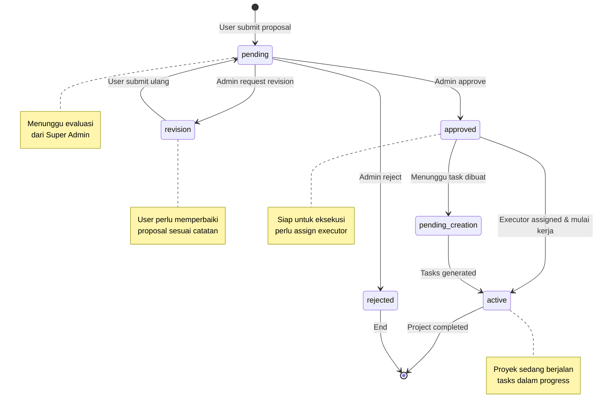
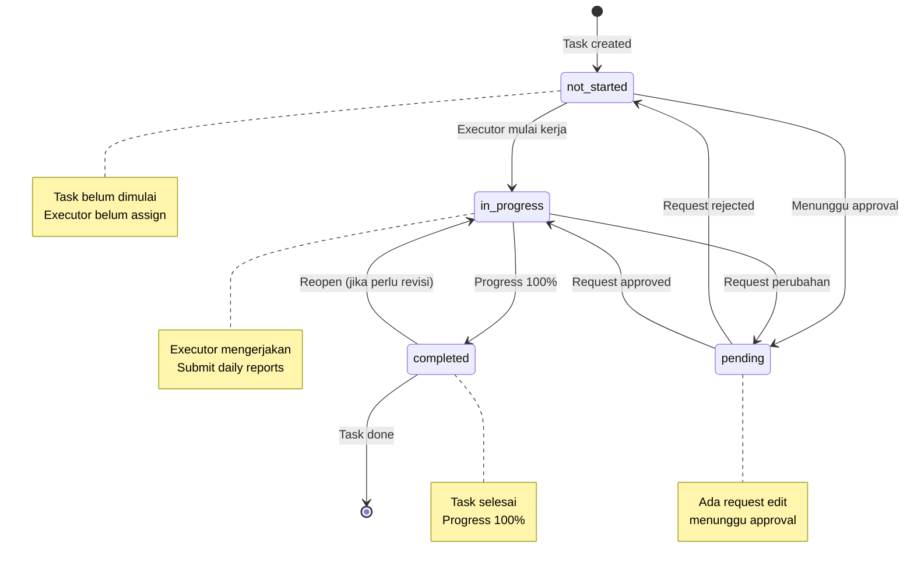
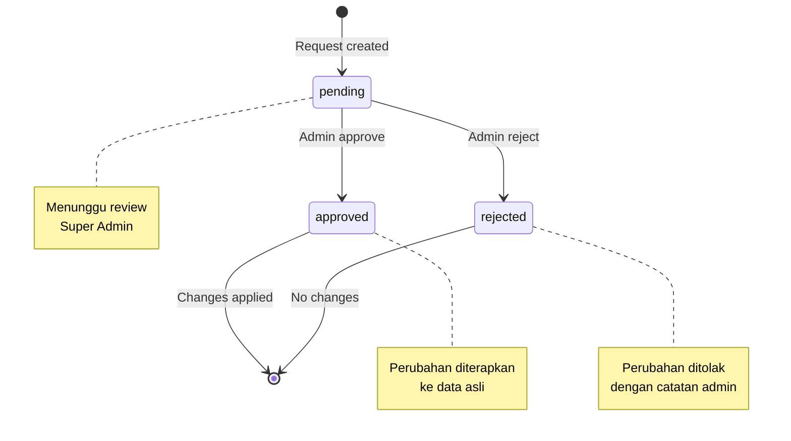
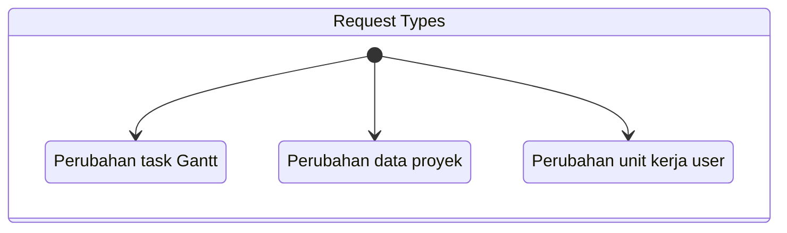
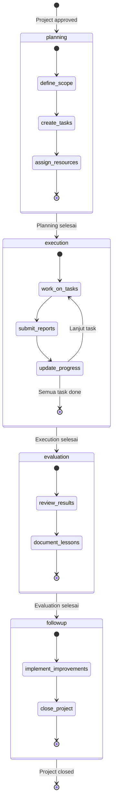
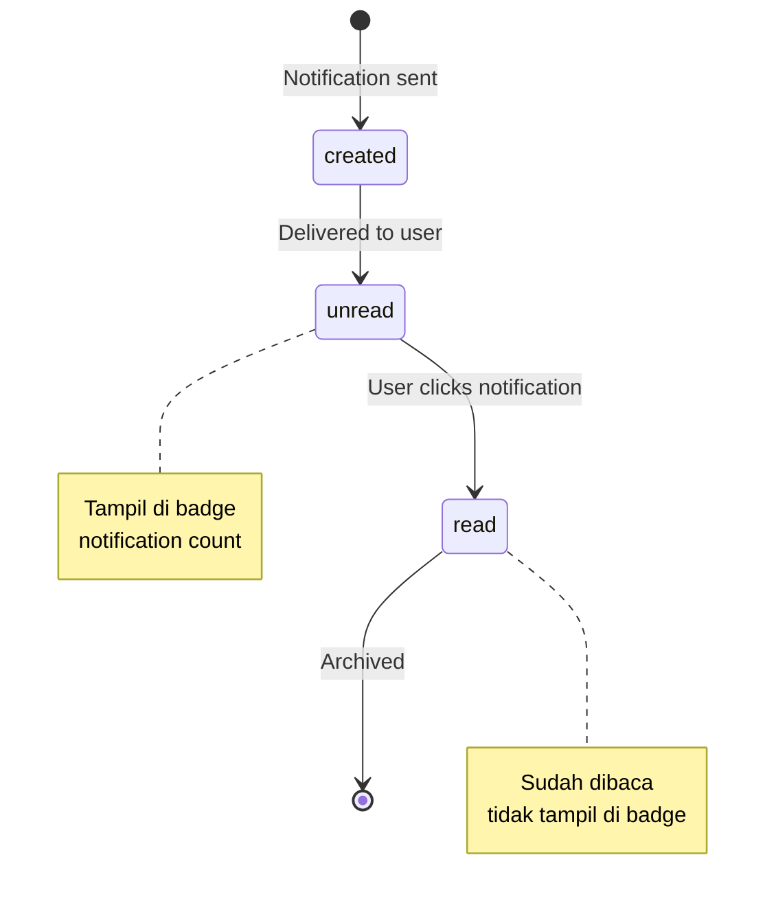
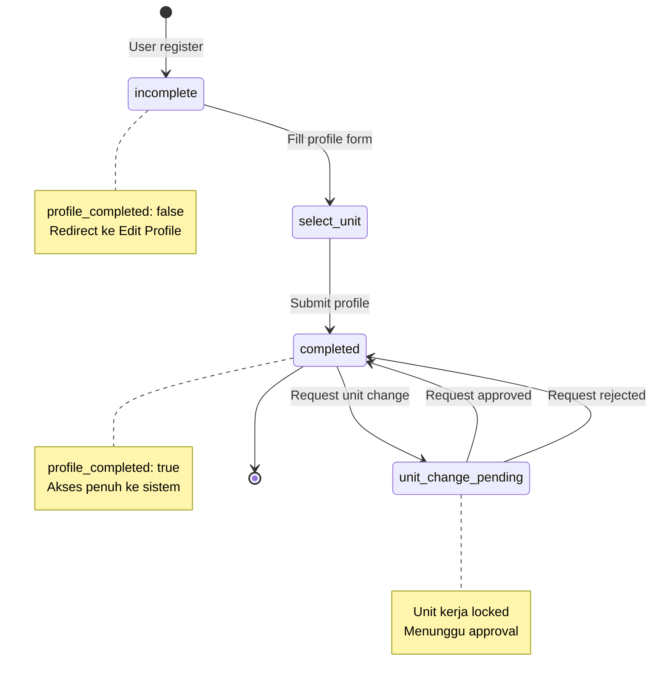
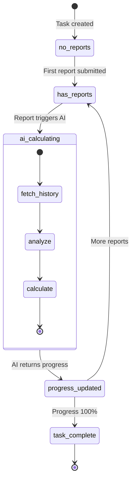

# State Diagram

Diagram ini menggambarkan transisi status dalam sistem SIMAPROS.

## 1. Status Proyek (Project Status)

### Penjelasan Status Proyek

| Status | Deskripsi | Aksi Selanjutnya |
|--------|-----------|------------------|
| `pending` | Proposal baru diajukan | Admin evaluasi & approve/reject/revision |
| `revision` | Perlu perbaikan | User perbaiki & submit ulang |
| `approved` | Disetujui | Assign executor, generate tasks |
| `pending_creation` | Menunggu task | Generate AI tasks |
| `active` | Sedang berjalan | Execute tasks, update progress |
| `rejected` | Ditolak | End state |

## 2. Status Task (Task Status)

### Penjelasan Status Task

| Status | Deskripsi | Aksi Selanjutnya |
|--------|-----------|------------------|
| `not_started` | Belum dimulai | Mulai kerjakan |
| `in_progress` | Sedang dikerjakan | Submit daily report, update progress |
| `pending` | Menunggu approval | Admin approve/reject |
| `completed` | Selesai | Archive atau reopen jika perlu |

## 3. Status Request (Edit Request Status)

### Tipe Request

## 4. Lifecycle Proyek (Project Stage)

### Penjelasan Stage Proyek

| Stage | Deskripsi | Aktivitas Utama |
|-------|-----------|-----------------|
| `planning` | Perencanaan | Define scope, create tasks, assign resources |
| `execution` | Pelaksanaan | Work on tasks, submit daily reports |
| `evaluation` | Evaluasi | Review results, document lessons learned |
| `followup` | Tindak Lanjut | Implement improvements, close project |

## 5. Status Notifikasi

## 6. User Profile Completion

## 7. Daily Report to Progress

