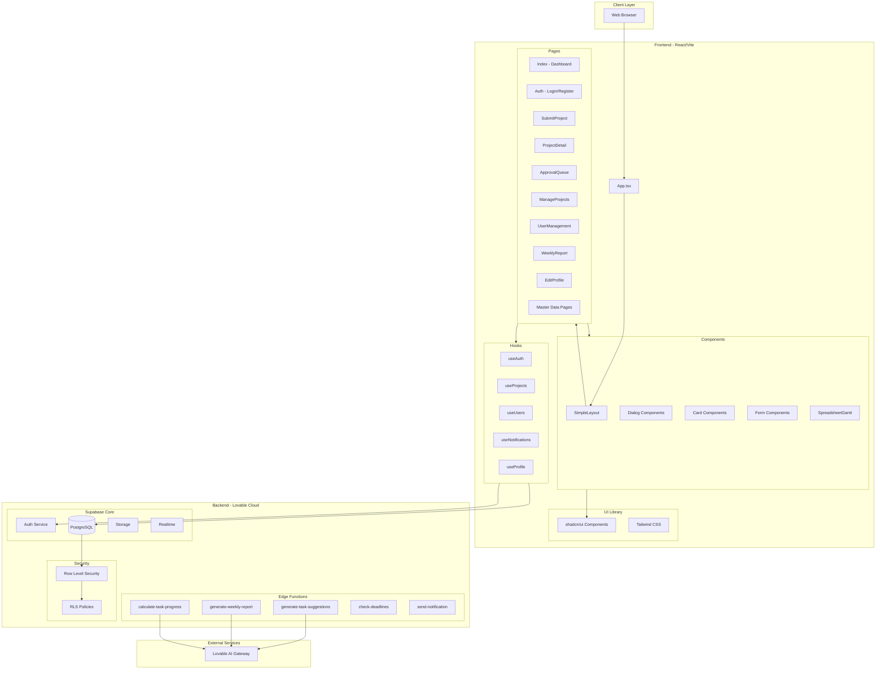
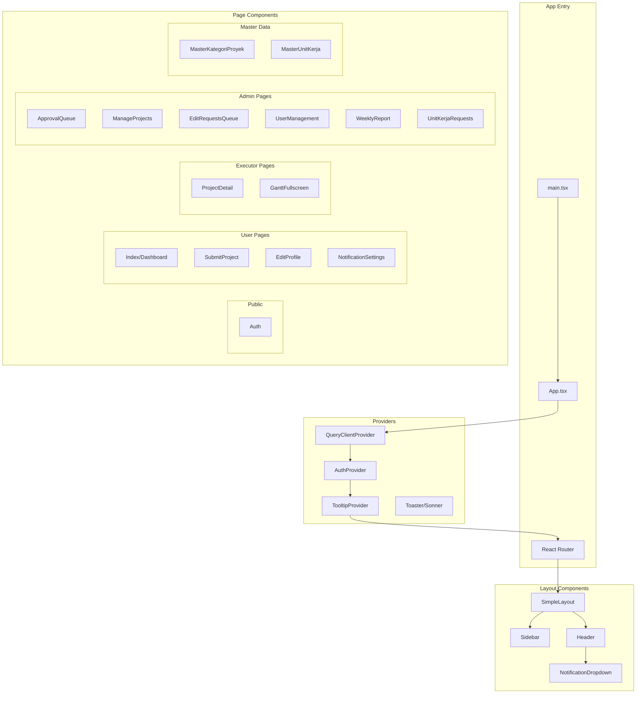
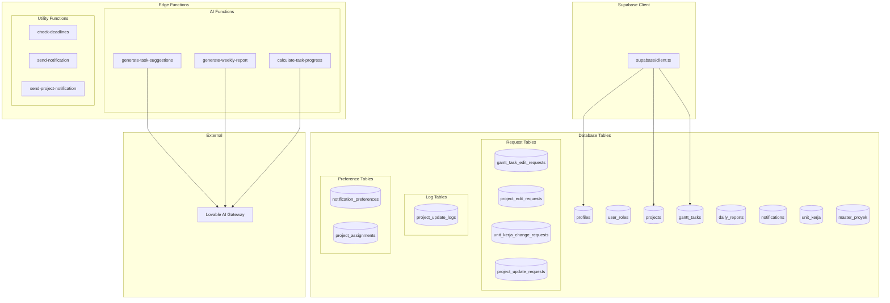
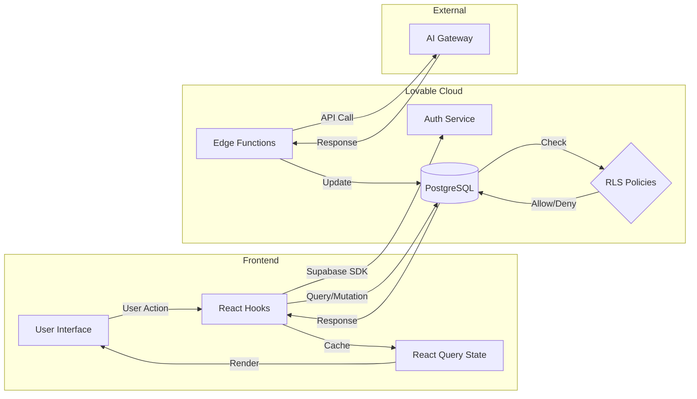
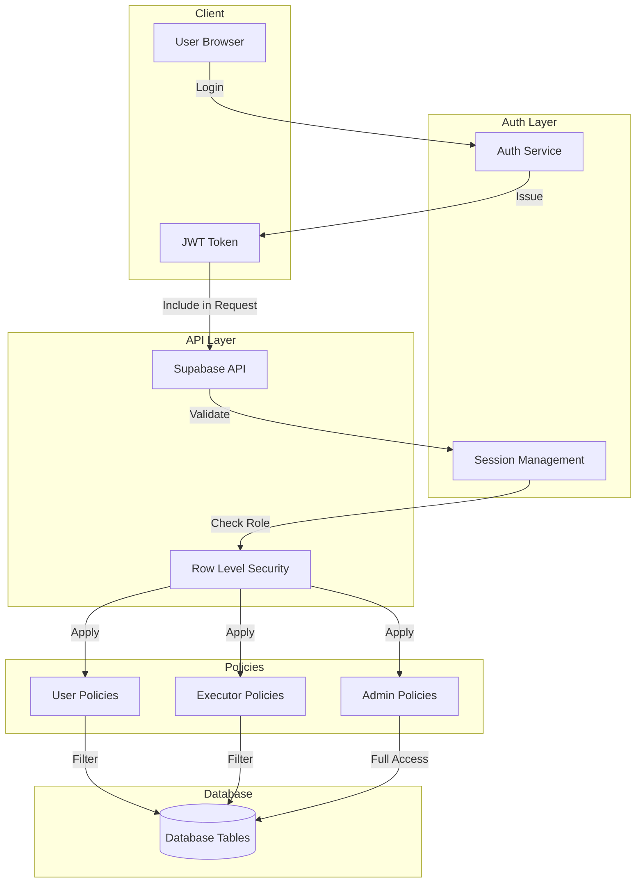
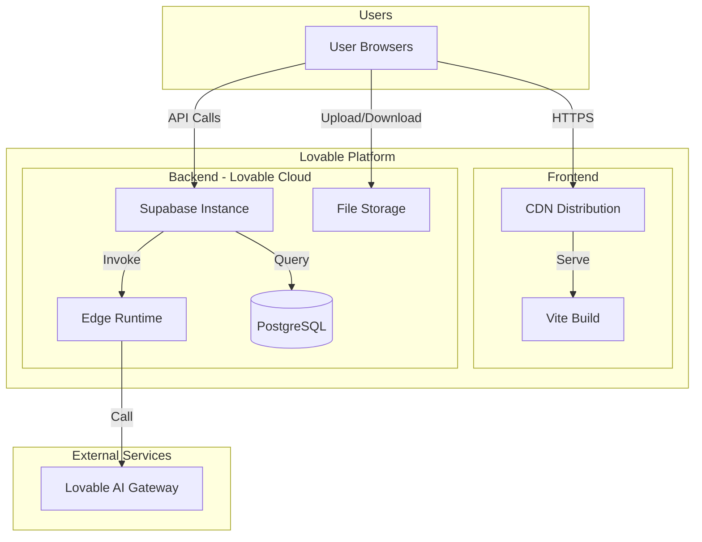

# Component Diagram

Diagram ini menggambarkan arsitektur komponen sistem SIMAPROS.

## Arsitektur Sistem

## Frontend Component Details

## Backend Component Details

## Data Flow

## Security Architecture

## Deployment Architecture

