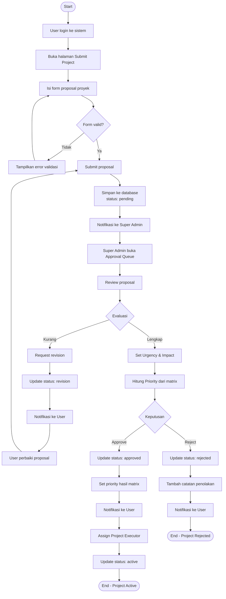
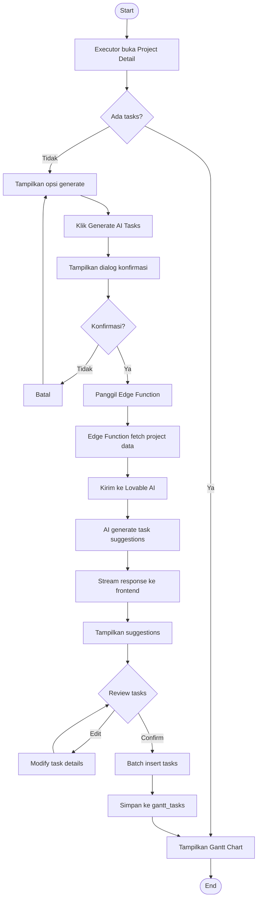
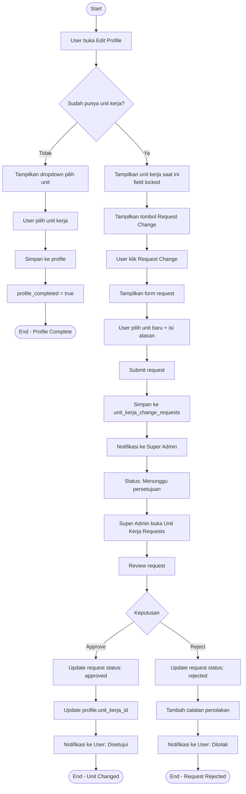
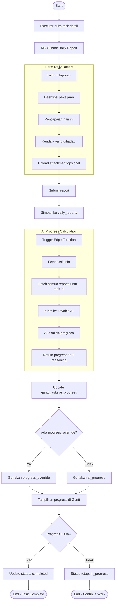
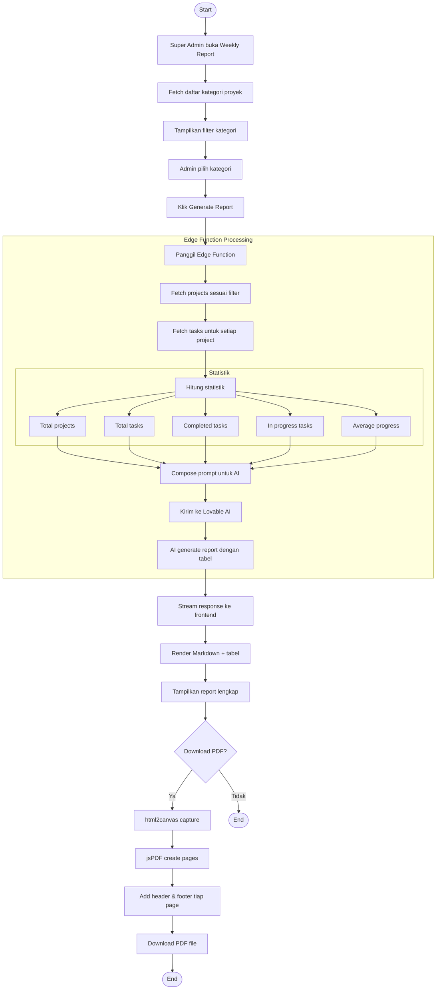
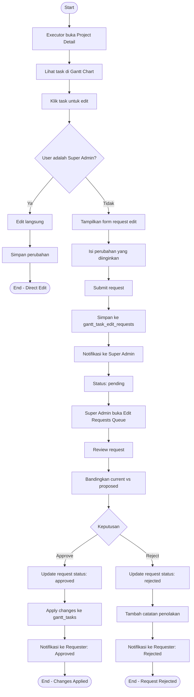
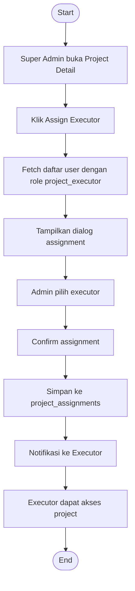
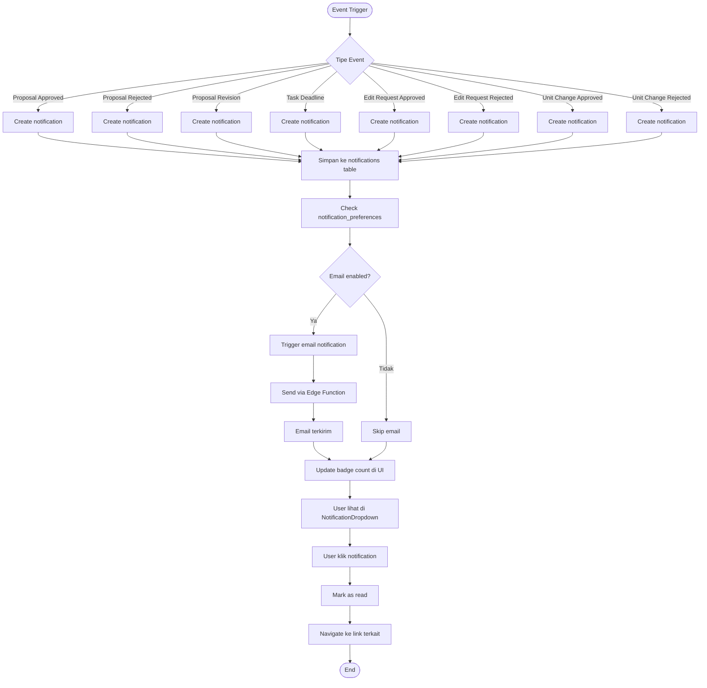

# Activity Diagram

Diagram ini menggambarkan alur aktivitas bisnis dalam sistem SIMAPROS.

## 1. Alur Submit dan Approval Proyek

## 2. Alur Generate AI Tasks

## 3. Alur Perubahan Unit Kerja

## 4. Alur Daily Report & AI Progress

## 5. Alur Generate Weekly Report

## 6. Alur Task Edit Request

## 7. Alur Assign Project Executor

## 8. Alur Notification Flow

